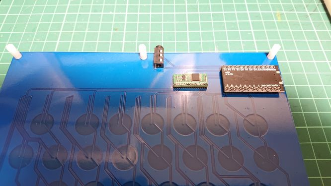
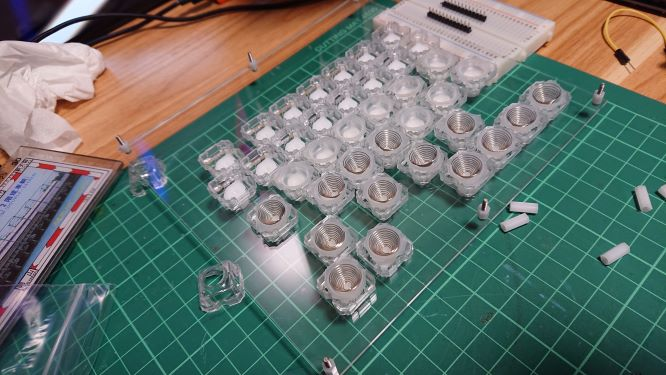
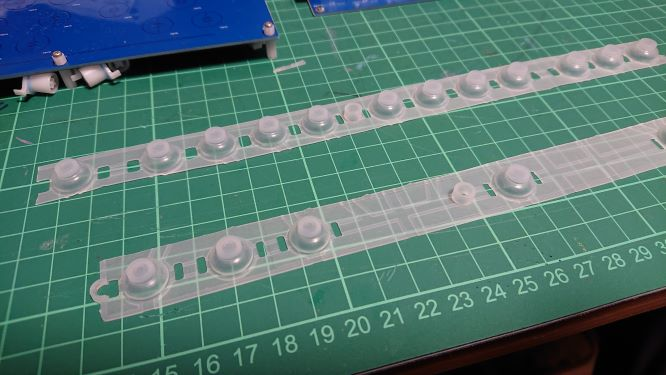

# micro TL Split Keyboard 18mm Rev1ビルドガイド

μTRON配列を採用した静電容量無接点方式の分割キーボード、micro TL Split Keyboard 18mmのRev1です。

リセットスイッチが必要な場面では、ProMicroのGNDとRSTを銅線などでショートさせて、リセットを押したのと同様の操作をしてください。

## 説明
micro TL Split Keyboard 18mm Rev1は、PCBが左右違います。
左右のPCBは、外側にProMicroをはめ込みます。PCBには、表面と裏面があります。"半月状の静電容量スイッチ接点が表面になる方が、表面です。

表面にした状態で、左端にProMicroのソケットが来るのが左側PCBです。

## 組み立て
### PCBへパーツ半田付け（左右のPCBについてそれぞれ実施）

- 静電容量スイッチスキャン用モジュールを、左右PCB裏面に実装します。

静電容量スイッチスキャン用モジュールを、左右PCB裏面に実装します。

PCBのJ1と記載あるスルーホールに、スルーホールの□とモジュールの□が合うように取り付けます。PCB裏面を見て、モジュールの部品が見える状態で正しく取り付けられます。

モジュールとモジュール付属のコネクタを半田付けしてから、モジュールを左右PCBに半田付けしてください。

通常のコネクタピッチより狭くなっているので、モジュールのコネクタがショートしないように気をつけてください。ショートしている場合は、正しく動作しません。半田を盛りすぎた場合は、半田吸い取り線などで半田を取り除きましょう。

- TRRSジャックを、左右PCB裏面に実装します。

TRRSジャックを、左右PCB裏面に実装します。左右PCBに、それぞれ半田付けしてください。

※裏面にシルク印刷されています。

### Pro Microへコンスルー半田付け（左右のPCBに接続するPro Microについてそれぞれ実施）

遊舎工房で購入すれば、コンスルー付きが買えます。

PCBから外した状態で、部品（USBコネクタなど）が実装されている面にコンスルーを載せて、半田付けします。

## ProMicroにファームウェア書き込み
[QMK Toolbox](https://github.com/qmk/qmk_toolbox) で、ファームウェア（hexファイル）をProMicroに書き込む必要があります。

[QMK Toolbox](https://github.com/qmk/qmk_toolbox) のインストール・使い方については、サリチル酸さんが書かれた[（初心者編）自作キーボードにファームウェアを書き込む](https://salicylic-acid3.hatenablog.com/entry/qmk-toolbox) が分かりやすいです。

[microtlk_default.hex](https://github.com/satromi/microtlk18_rev0/blob/main/microtlk_default.hex) を左のリンクを右クリックしてファイルダウンロードして、QMK Toolboxで書き込みます。
左右のProMicroそれぞれ書き込みが必要です。

リセットスイッチがこのバージョンには付いていないので、リセットスイッチを押す場面では、GNDとRSTを銅線などでショートさせてください。

### 静電容量スイッチ取付（左右のPCBについてそれぞれ実施）

静電容量スイッチをトッププレートに取り付けます。まず、トッププレート表面にねじ頭が来るように裏面にスペーサー(4mm)をはさみ、上下左右8カ所ネジ止めします。この後、トッププレートにスイッチを取り付けますが、先にネジを止めておかないと、後からやりづらいので先にやっておきましょう。

ここから先は、トッププレートを直置きしているとプランジャーやラバードームが浮いてしまって作業しにくくなります。何かで浮かせた状態で進めてください。

トッププレート裏面にNIZ ECスイッチのハウジングをはめていきます。さらに、ハウジングにプランジャーをはめていきます。プランジャーは向きがあるので、隙間に合わせて入れてください。

ラバーシートを切って、ラバードームとしてハウジングにはまるサイズに切っていきます。裏返した状態なので、ラバードームはプランジャーの上に載せます。さらに、コニックリングをラバードームの上に載せていきます。

全てのスイッチを載せ終わったら、トッププレートにPCBをかぶせてきます。かぶせたら、足にするスペーサー(10mm)で止めていきます。

### ProMicro取付

できたら、左右PCBの裏面にはめ込みます。基板の外側（左側は左、右側は右）にUSBコネクタが来るようにはめます。

## 動作確認

左右のキーボードをTRRSケーブルで繋いだら、左側にUSBケーブルでPCと接続し、動作確認してください。

左右どちらかのキーボードを接続した状態で、 [QMK Toolbox](https://github.com/qmk/qmk_toolbox) を起動すると、各キーの静電容量の値が読み取れます。

ボタン押下は325、押上は275を閾値にしています。大きく違うキーがある場合は、そのキーのうまくラバードーム、コニックリングが上手く填まっていない場合があります。
その場合は、静電容量スイッチ取付をやり直してみるか、填まっていないキーを何度も押すかしてみてください。

それでも改善しない場合は、作者に [メール](satromi@gmail.com) でご相談ください。